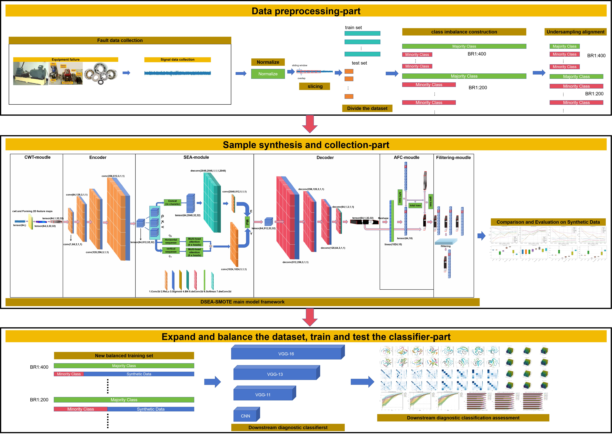
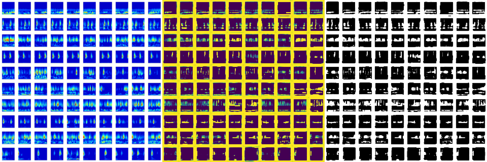
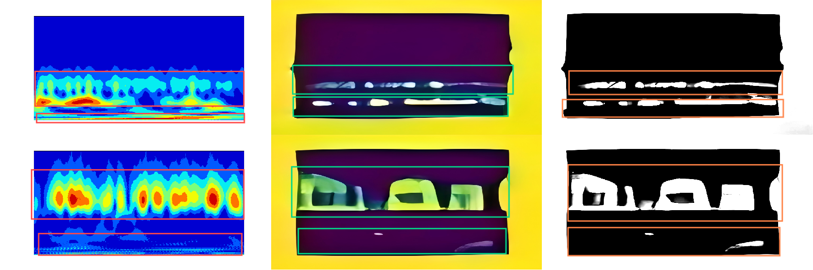
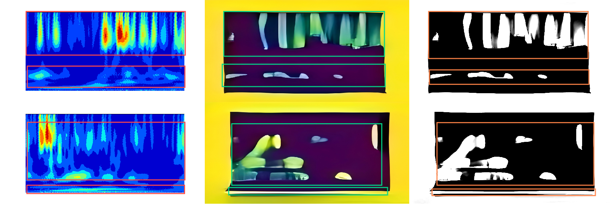

# DSEA-SMOTE

## Code background
In industrial production, the imbalance between sparse failure signals and abundant normal signals
biases fault diagnosis models towards the normal class,
reducing accuracy and reliability. Existing synthetic data
methods help mitigate this but often neglect spatiotemporal long-distance dependencies and local feature similarities, limiting their effectiveness. To address these limitations, we propose Deep Squeeze-enhanced Axial Transformer Synthetic Minority Oversampling Technique (DSEA-SMOTE). This method integrates a specially designed
continuous wavelet transform data filtering preprocessing
technology module that converts one-dimensional time-domain data into a two-dimensional feature map, enhancing model performance while simplifying feature learning.
It then captures spatiotemporal long-distance dependencies and feature similarities in space-time slices through
the novel Squeeze-enhanced Axial Attention mechanism
and Auxiliary Feature Classifier. A Multi-category Sample
Feature Filtering Technology module is also introduced to
further improve synthesis quality. Additionally, we refine
the loss function based on the Auxiliary Feature Classifier
to enhance generation quality. Experimental evaluations
on two real-world datasets show that DSEA-SMOTE outperforms recent techniques. Ablation experiments further
verify the effectiveness of each component in our design.Future work will extend DSEA-SMOTE to medical image
synthesis for rare diseases, remote sensing image synthesis for
extreme natural disasters, radar signal synthesis for aviation
objects, and explore its use with other modalities.

## Code repository introduction
This code repository is the source code of the paper "Deep Squeezze-enhanced Axial Transformer SMOTE: A Novel Approach For Imbalance-bearing Fault Diagnosis". It mainly provides the framework code and related processing code of the novel data synthesis model framework DSEA-SMOTE. It also provides related data files.Below is a schematic diagram of the model framework of the entire paper.

Below are the results of the model synthesizing samples under extremely unbalanced conditions (BR 1:400) (from left to right: original sample, synthesized sample color map, synthesized sample grayscale map).

Meanwhile, the following is an explanation for the long distance dependence of sample synthesis in space-time and the similarity of overall and local features of space-time slices.

Experimental hardware setup and software setup:
Software Environment PyTorch 2.3.0, Python 3.12 (Ubuntu 22.04), Cuda 12.1
CPU 12 vCPU Intel(R) Xeon(R) Silver 4214R CPU @ 2.40GHz
GPU RTX 3080 Ti (12GB)
Memory 90GB

## Usage Statement
This paper uses the CWRU and SEU public datasets. If you use the code in this paper, please cite our paper and light up the star for our project. If you use it for commercial purposes, please contact the author of the paper.
