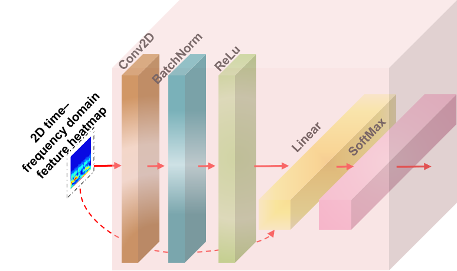

# DLRSD-SMOTE（Deep Long-Range Spatiotemporal Dependency Synthetic Minority Oversampling Technique For Imbalance-bearing Fault Diagnosis）

## Code background
Bearing fault diagnosis is critical for preventing industrial downtime, but real-world datasets suffer
from extreme class imbalance, which biases deep models toward the majority class. Existing over sampling techniques neglect long-range spatiotemporal dependencies, leading to low-fidelity minority
samples and poor generalization. To solve the problem, we propose Deep Long-Range Spatiotemporal
Dependency Synthetic Minority Oversampling Technique (DLRSD-SMOTE). The proposed method
begins with a novel Signal Feature Transform block, which employs Continuous Wavelet Transform
and convolutional layers to convert 1D time-domain signals into 2D time–frequency feature heatmaps,
enhancing model expressiveness and feature learning. Next, the proposed Seaformer Auto-Encoding
and Decoding blocks extract high-dimensional features and model long-range spatiotemporal dependencies. A well-designed Auxiliary Feature Classifier block is then used to generate class-specific
synthetic samples. To ensure stable convergence of the proposed DLRSD-SMOTE network and
enable the generation of high-quality samples, a customized optimization loss function is constructed.
This function is designed based on both the sample reconstruction error and the classification
accuracy of category labels, thereby effectively guiding the training process. Finally, a Multi-Class
Filtering SMOTE block is proposed to retain only high-quality samples and enhance minority class
representations, thereby ensuring class balance. Extensive experiments on two real-world datasets
confirm the superior performance of DLRSD-SMOTE over recent baselines. Ablation studies further
validate the contributions of each module. Notably, under a 1:5 balance ratio, DLRSD-SMOTE
achieves an accuracy of 99.02%. Code is available at: https://github.com/amstlldj/DLRSD-SMOTE.

## Code repository introduction
This code repository is the source code of the paper "Deep Long-Range Spatiotemporal Dependency Synthetic Minority Oversampling Technique For Imbalance-bearing Fault Diagnosis". It mainly provides the framework code and related processing code of the novel data synthesis model framework DLRSD-SMOTE. It also provides related data files.Below is a schematic diagram of the model framework of the entire paper.

Below are the results of the model synthesizing samples under extremely unbalanced conditions (BR 1:400) (from left to right: original sample, synthesized sample color map, synthesized sample grayscale map).

Meanwhile, the following is an explanation for the long distance dependence of sample synthesis in space-time and the similarity of overall and local features of space-time slices.

Experimental hardware setup and software setup:
Software Environment PyTorch 2.3.0, Python 3.12 (Ubuntu 22.04), Cuda 12.1
CPU 12 vCPU Intel(R) Xeon(R) Silver 4214R CPU @ 2.40GHz
GPU RTX 3080 Ti (12GB)
Memory 90GB

## Usage Statement
This paper uses the CWRU and SEU public datasets. If you use the code in this paper, please cite our paper and light up the star for our project. If you use it for commercial purposes, please contact the author of the paper.

## Citation format
The citation format of the paper repository is：

@software{amstlldj_2025_15148882,
  author       = {Hongliang Dai, Dongjie Lin, Junpu He, Xinyu Fang, Siting Huang},
  title        = {amstlldj/DLRSD-SMOTE: v1.0.0},
  month        = apr,
  year         = 2025,
  publisher    = {Zenodo},
  version      = {v1.0.0},
  doi          = {10.5281/zenodo.15148882},
  url          = {https://doi.org/10.5281/zenodo.15148882},
  swhid        = {swh:1:dir:0bb059f1238a40321849a1b562115347aed38a88
                   ;origin=https://doi.org/10.5281/zenodo.15148881;vi
                   sit=swh:1:snp:61d7b3083fcc7fd599982eb07fd885fa0a42
                   a551;anchor=swh:1:rel:66dc4daa4cd603c2933ddcae1fc0
                   b9e43c864b6b;path=amstlldj-DLRSD-SMOTE-5a1079d
                  },
}

or

@misc{DLRSD-SMOTE, author = {Hongliang Dai, Dongjie Lin, Junpu He, Xinyu Fang, Siting Huang}, title = {DLRSD-SMOTE}, year = {2025}, publisher = {Zenodo}, doi = {10.5281/zenodo.15148882}, url = {https://github.com/amstlldj/DLRSD-SMOTE}}

## Subsequent maintenance plan
There is still room for improvement in the readability of the project code. We plan to refactor the code of the entire project and upload the weight file in the future.(2025-3-26)
If you want to see our latest work, you can take a look at our SCIF-CFGRF model project, which is more mature and has uploaded the model's weight file, which can be run directly for testing.(https://github.com/amstlldj/SCIF-CFGRF)
